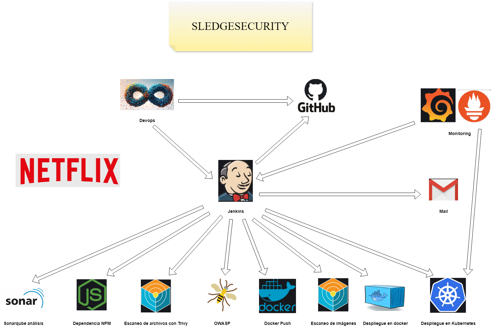

# SledgeSecurity

Proyecto fin de grado de Luis Miguel Miras Díaz y Rafael Jiménez Burgos.

# Objetivo del proyecto

Hemos decidido replciar la interfaz web de Netflix mediante un proyecto CI/CD y aplicando a su vez la metodología DevOps, con el fin de asemejarse todo lo posible a la realidad del mundo laboral pero aportándole una capa extra de seguridad, parar ello hemos empleado el servicio en la nube de AWS para albergar nuestras máquinas, contendores en Docker para almacenar nuestra aplicación, herramientas de monitorización como Grafana, herramientas de seguridad como son OWASP o Trivy y otras tecnologías que no se mencionan en esta descripción pero ayudarán también a cumplir nuestro objetivo.

# Esquema del proyecto

# Checkpoint
[Video CheckPoint](https://youtu.be/CTjzCZpz3cc)

# Video final
[Video final de proyecto](https://youtu.be/rcl0OyXX8Us)

# Presentación del proyecto
[PDF](https://drive.google.com/file/d/19DlPgO09PR1xiacRM9loUG8luHRh3PAU/view?usp=sharing)

# Plan de Seguridad
[Seguridad](https://drive.google.com/file/d/1mKfZqmBkIZlaDVKTDHgvJsAPtrNdZXIF/view?usp=sharing)

### Software Utilizado y versiones:
- Jenkins 2.452.1
- Docker 24.0.5
- SonarQube Community Edition v9.9.5 (Bajo Docker)
- Prometheus 2.52.0 y Grafana 11.0.0
- Email Notification

# Histórico de cambios
Inicio de proyecto hasta 03/06/2024
- Se ha creado dos instancias EC2, Jenkins-Master y Jenkins-Agent.
- Se ha añadido la funcionalidad de notificación por Email en Jenkins.
- Se ha levantado y configurado SonarQube bajo Docker.
- Se ha configurado Prometheus (Sistema de monitorización y alertas), junto a Grafana.

## Direcciones URL de las instancias EC2 creadas en AWS
* Jenkins: https://proyectoasirjenkins.ddns.net/
* SonarQube: http://54.85.121.151:9000/
* Grafana: http://44.223.163.86:3000/
* Prometheus: http://44.223.163.86:9090/
* Web Netflix: http://35.172.40.117:8081/

### Bibliografía
- [Instalar Jenkins en Linux](https://www.jenkins.io/doc/book/installing/linux/)
- [SonarQube con Docker Compose](https://medium.com/@denis.verkhovsky/sonarqube-with-docker-compose-complete-tutorial-2aaa8d0771d4)
- [Instalar Prometheus en Linux](https://prometheus.io/docs/prometheus/latest/getting_started/)
- [Instalar Grafana en Linux](https://grafana.com/docs/grafana/latest/setup-grafana/installation/debian/)
- [Instalar SonarQube con Docker](https://docs.sonarsource.com/sonarqube/latest/setup-and-upgrade/install-the-server/installing-sonarqube-from-docker/)
